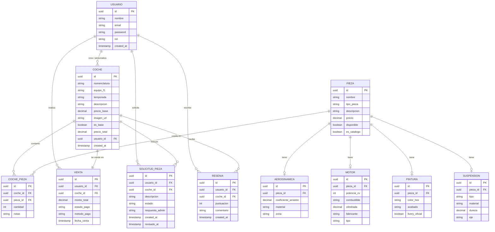

# GCS

GCS Javi Patas Compra un Dominio por un céntimo esta vez si punto com

# Esquema

```mermaid
erDiagram
  USUARIO {
    uuid id PK
    string nombre
    string email
    string password
    string rol
    timestamp created_at
  }

  COCHE {
    uuid id PK
    string nomenclatura
    string equipo_f1
    string temporada
    string descripcion
    decimal precio_base
    string imagen_url
    boolean es_base
    decimal precio_total
    uuid usuario_id FK
    timestamp created_at
  }

  PIEZA {
    uuid id PK
    string nombre
    string tipo_pieza
    string descripcion
    decimal precio
    boolean disponible
    boolean es_catalogo
  }

  AERODINAMICA {
    uuid id PK
    uuid pieza_id FK
    decimal coeficiente_arrastre
    string material
    string zona
  }

  MOTOR {
    uuid id PK
    uuid pieza_id FK
    int potencia_cv
    string combustible
    decimal cilindrada
    string fabricante
    string tipo
  }

  PINTURA {
    uuid id PK
    uuid pieza_id FK
    string color_hex
    string acabado
    boolean livery_oficial
  }

  SUSPENSION {
    uuid id PK
    uuid pieza_id FK
    string tipo
    string material
    decimal dureza
    string eje
  }

  COCHE_PIEZA {
    uuid id PK
    uuid coche_id FK
    uuid pieza_id FK
    int cantidad
    string notas
  }

  SOLICITUD_PIEZA {
    uuid id PK
    uuid usuario_id FK
    uuid coche_id FK
    string descripcion
    string estado
    string respuesta_admin
    timestamp created_at
    timestamp revisado_at
  }

  VENTA {
    uuid id PK
    uuid usuario_id FK
    uuid coche_id FK
    decimal monto_total
    string estado_pago
    string metodo_pago
    timestamp fecha_venta
  }

  RESENIA {
    uuid id PK
    uuid usuario_id FK
    uuid coche_id FK
    int puntuacion
    string comentario
    timestamp created_at
  }

  USUARIO ||--o{ COCHE : "crea / personaliza"
  USUARIO ||--o{ SOLICITUD_PIEZA : "solicita"
  USUARIO ||--o{ VENTA : "realiza"
  USUARIO ||--o{ RESENIA : "escribe"

  COCHE ||--o{ COCHE_PIEZA : "contiene"
  COCHE ||--|| VENTA : "se vende en"
  COCHE ||--o{ SOLICITUD_PIEZA : "incluye"
  COCHE ||--o{ RESENIA : "recibe"

  PIEZA ||--o{ COCHE_PIEZA : "usada en"
  PIEZA ||--o| AERODINAMICA : "tiene"
  PIEZA ||--o| MOTOR : "tiene"
  PIEZA ||--o| PINTURA : "tiene"
  PIEZA ||--o| SUSPENSION : "tiene"
```

